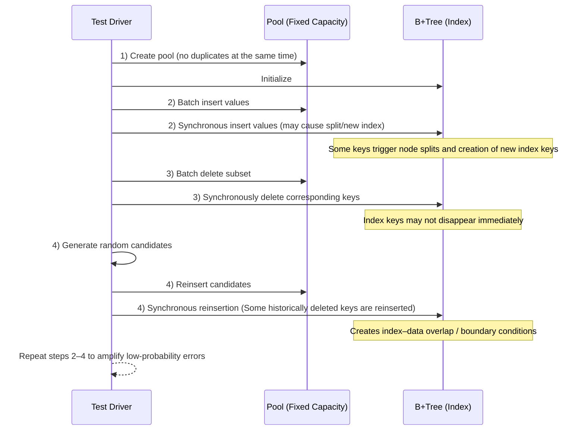

# Mode 2 : Pool-Based Boundary Testing
<small>模式二：边界条件测试</small>
***

## Introduction

This document introduces a pool-based testing model for B Plus Trees.

By combining fixed-capacity pools with repeated insertion and deletion cycles, the method naturally creates boundary conditions.

These scenarios expose hidden flaws, ensuring stability and consistency under long-term, high-pressure operations.

## Test Process

### Create the Pool

- Create a pool with fixed capacity.
- Ensure that at any given time there are no duplicate values inside the pool (historical repetition is allowed).

### Synchronous Insertion

- Insert a sequence of values into both the pool and the B Plus Tree simultaneously.
- Some of these values may cause B Plus Tree node splits and generate new index keys.

## Synchronous Deletion

- Delete a portion of values from both the pool and the B Plus Tree.
- Note : In a B Plus Tree, after deleting a data entry, the corresponding index key may not disappear immediately, and might temporarily remain (due to partial release).

## Random Reinsertion

- Generate new values to insert using randomness; these values may be identical to previously deleted ones.
- When these old values are reinserted, the B Plus Tree will attempt to relocate the index within the existing structure, creating a test scenario of index–data overlap / boundary conditions.

