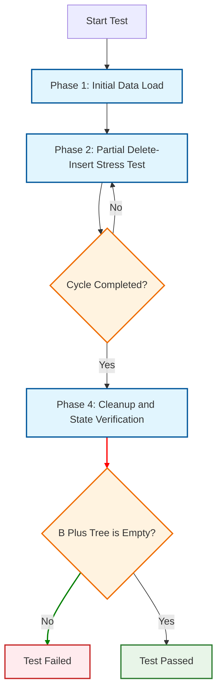

# Mode 3 : Single Node Endurance Test Mode
<small>模式三：单一节点耐久性测试</small>
***

## Introduction

This test focuses on one single spot in the B Plus tree.

I use the same set of keys over and over again.

Each time, we shuffle their order, then add and remove them from that same spot.

I repeat this process many times to see if this specific location gets worn out or breaks under the strain.

This ensures that even the smallest part of the tree is solid and reliable.

## Test Process

This test aims to validate the stability and durability of a single B Plus tree node under repeated insertion and deletion operations through a structured four-phase process.

### Phase 1: Initial Data Load

- Insert a complete set of predefined initial keys into an empty B Plus tree.
- This phase aims to complete the initial construction and data population of the node.

### Phase 2: Partial Delete-Insert Stress Test

- Randomly select a subset of keys from those already inserted.
- Perform multiple rounds of deletion and re-insertion operations on this subset to simulate high-frequency local data updates.

### Phase 3: Cycle Endurance Test

- Repeatedly execute Phase 1 and Phase 2 multiple times.
- This continuous cycle of "local population → local disturbance" subjects the node structure to sustained endurance stress.

### Phase 4: Cleanup and State Verification

- Sequentially delete all keys stored in the B Plus tree.
- Finally, verify that the B Plus tree successfully returns to its initial empty node state, ensuring no memory leaks or structural residues remain.

