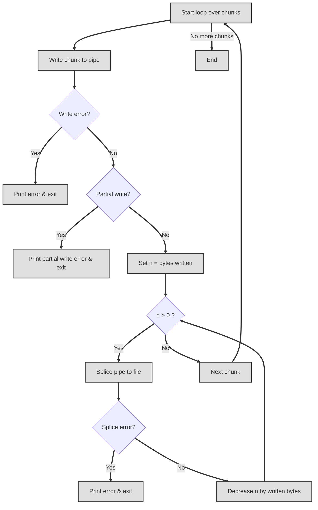

```mermaid
flowchart TD
    A[Start loop over chunks] --> B[Write chunk to pipe]
    B --> C{Write error?}
    C -->|Yes| D[Print error & exit]
    C -->|No| E{Partial write?}
    E -->|Yes| F[Print partial write error & exit]
    E -->|No| G[Set n = bytes written]

    G --> H{n > 0 ?}
    H -->|Yes| I[Splice pipe to file]
    I --> J{Splice error?}
    J -->|Yes| K[Print error & exit]
    J -->|No| L[Decrease n by written bytes]
    L --> H

    H -->|No| M[Next chunk]
    M --> A

    A -->|No more chunks| N[End]

    %% Style: nodes (gray rectangles)
    style A fill:#e0e0e0,stroke:#333,stroke-width:2px
    style B fill:#e0e0e0,stroke:#333,stroke-width:2px
    style D fill:#e0e0e0,stroke:#333,stroke-width:2px
    style F fill:#e0e0e0,stroke:#333,stroke-width:2px
    style G fill:#e0e0e0,stroke:#333,stroke-width:2px
    style I fill:#e0e0e0,stroke:#333,stroke-width:2px
    style K fill:#e0e0e0,stroke:#333,stroke-width:2px
    style L fill:#e0e0e0,stroke:#333,stroke-width:2px
    style M fill:#e0e0e0,stroke:#333,stroke-width:2px
    style N fill:#e0e0e0,stroke:#333,stroke-width:2px

    %% Style: thicker lines
    linkStyle default stroke-width:3px
```

